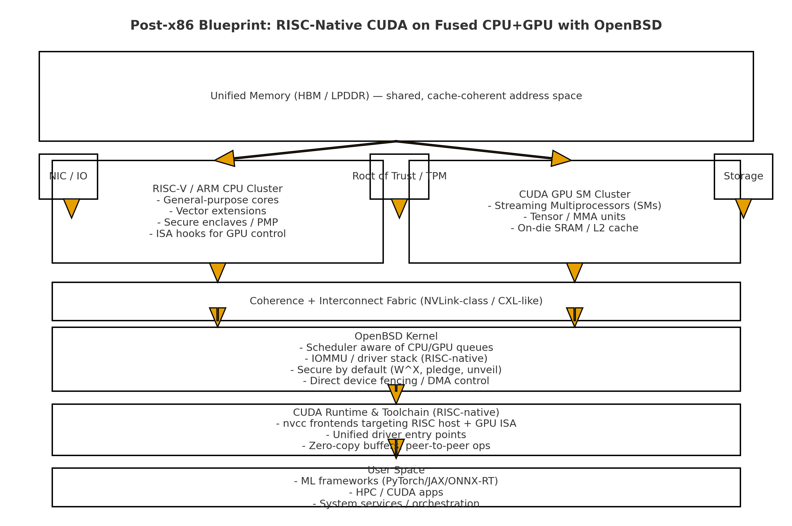
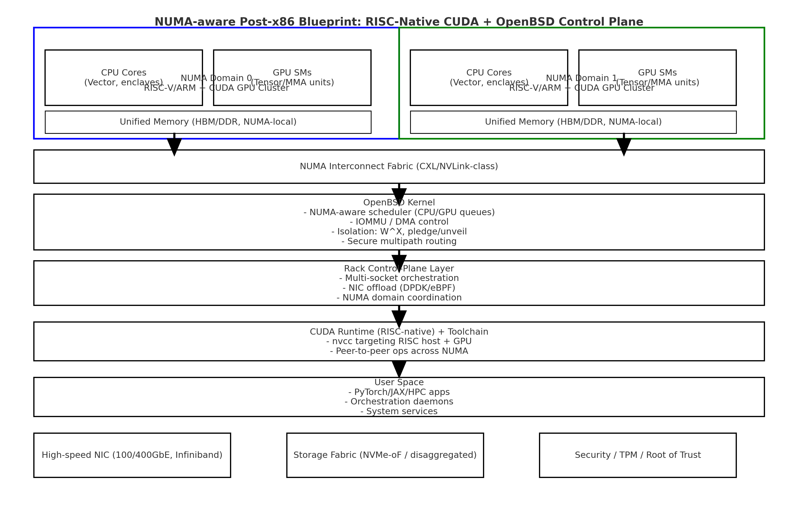

# Post‑x86 Blueprint: RISC‑Native CUDA + OpenBSD

This repo presents a conceptual architecture for a **clean break from x86**: 
fusing RISC‑V/ARM CPUs with CUDA GPUs into a single die, unified by **OpenBSD as the kernel**.

## Why?
- **x86 is legacy cruft** — bloated instruction sets, opaque microcode, endless abstraction leaks.
- **RISC‑V/ARM are leaner** — royalty‑free, extensible, globally adopted in AI/datacenter designs.
- **OpenBSD is strict and minimal** — security‑by‑default, hardware‑close, perfect for direct CPU/GPU binding.
- **Unified memory + fused packages** — eliminates bottlenecks between host CPUs and GPU accelerators.

## Architecture Overview

### Single‑Socket Design

**Key Features:**
- RISC‑V/ARM CPU cluster with vector + enclave extensions
- CUDA GPU SMs on‑die, unified cache‑coherent memory
- OpenBSD kernel with NUMA‑aware scheduler, strict DMA/IOMMU control
- RISC‑native CUDA runtime + toolchain

### NUMA‑Aware Rack‑Scale Design

**Key Features:**
- Multi‑socket NUMA domains with local HBM
- High‑speed interconnect fabric (CXL/NVLink‑class)
- OpenBSD kernel coordinating CPU+GPU queues across sockets
- Rack‑level control plane with NIC offload + multipath routing

## Why OpenBSD?
Unlike Linux, OpenBSD offers:
- **1:1 hardware transparency**
- Mandatory security policies (W^X, pledge, unveil)
- Minimal bloat → lower latency, easier verification

## Roadmap
- Define **RISC‑native CUDA toolchain** (nvcc targeting RISC host+GPU ISA)
- Extend **OpenBSD scheduler** for GPU queues
- Explore **RISC‑V GPU ISA extensions** for unified compute
- Build a **prototype driver + runtime shim**

## License
MIT — free to adapt, extend, or implement.

---

**Manifesto:**  
This blueprint is a call to abandon the duct‑taped x86/Linux/proprietary stack, 
and replace it with a transparent, unified, secure compute foundation.

